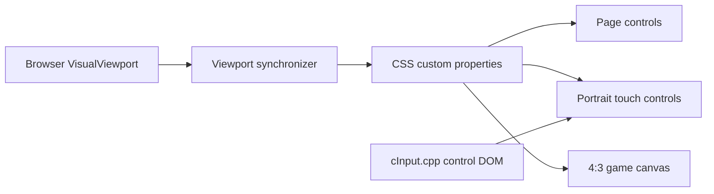
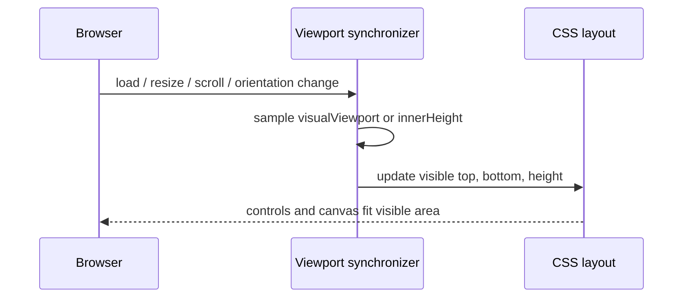

# Portrait visual viewport fit

## Challenge / purpose / success

- Challenge: mobile portrait controls can extend below the actually visible browser area when browser chrome reduces `window.visualViewport` without reducing the CSS layout viewport.
- Purpose: keep every touch control visible and immediately tappable while retaining the enlarged portrait controls whenever space permits.
- Success: all 17 portrait buttons, the 4:3 canvas, and page controls remain inside the actual visible viewport without overlap; landscape, fullscreen, hidden-controls, gamepad/key configuration, and audio lifecycle behavior remain unchanged.

## Authority and invariant

`window.visualViewport` owns the visible top, bottom, and height. A small page synchronizer projects those values to CSS custom properties. When `VisualViewport` is unavailable, `window.innerHeight` is the fallback authority.

Invariant: in portrait mobile mode, the page controls, 4:3 canvas, and touch panel must all remain inside the visible viewport without overlap. The page-control strip is `max(40px, safe-area-top + 36px)` and a compact minimum game region is reserved before touch rows are scaled. Target row heights are preserved while they fit and are reduced only as much as required by the remaining visible height. The supported visual-height floor is 400px including representative 47px top and 34px bottom safe areas; at that boundary every control row remains at least 32px and the 4:3 game remains at least 80px high.

## Runtime sequences

Fallback path: if `window.visualViewport` is missing, the same synchronizer publishes `innerHeight` with zero visual offset. No domain entities or services are introduced; this is browser UI infrastructure only.

## Alternatives

- CSS `svh` only: rejected because it cannot reliably represent `visualViewport.offsetTop` and OEM browser chrome behavior.
- Always reduce the buttons: rejected because it regresses the requested portrait button size.
- Scrollable controls: rejected because controls must stay simultaneously visible and immediately tappable.

## Blast radius and verification

- Generator: `tools/build-web.ps1`
- Generated trial pages: `docs/play/ggn.html`, `docs/play/index.html`
- Contract tests: `tools/test-web-touch-layout.js`
- Regression checks: landscape and hidden-controls layout, fullscreen controller, gamepad/key configuration, and audio lifecycle tests
