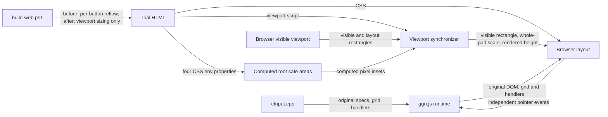
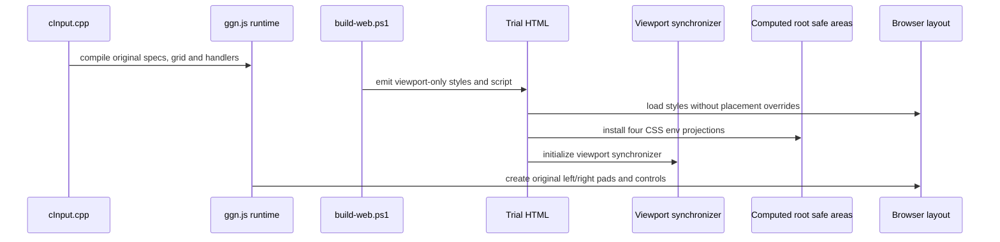
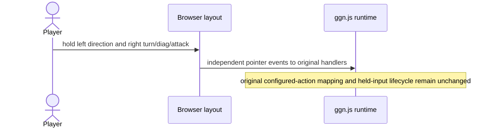
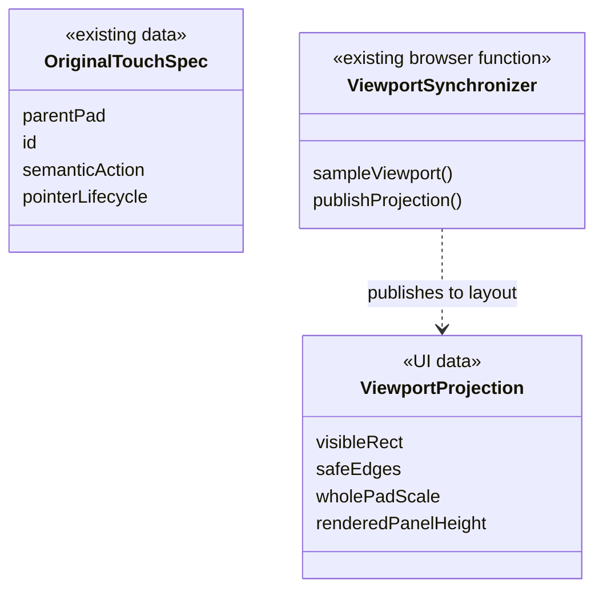

# Portrait viewport fit with the author's original two-pad layout

## Authoritative decision (2026-09-03)

- Challenge: the portrait reflow replaced the author's two-pad design; the attempted restoration in `92bbbe4` still put turn and diagonal-lock controls on the left.
- Purpose: restore the authored arrangement faithfully so movement and every right-hand action remain usable together.
- Success: all 17 controls keep their original parent, grid position, span, hierarchy, and input semantics; both pads and the 4:3 canvas fit the visible viewport; landscape, fullscreen, hidden controls, key/gamepad configuration, and audio lifecycle do not regress.
- Approval: the user explicitly required both turn and diagonal-lock on the right, then said: 「元の洗練された配置に戻してください。私がデザインしたものです」.

This decision supersedes the four-column portrait reflow introduced in `e7d3a4b` and the one-column action rail in `92bbbe4`. The latter narrowed the user's restoration request to four combat actions and incorrectly treated that narrower interpretation as approved.

## Sources and restored contract

- Authored refinement: `abe54d23b7db34ef8e093591932bd8da985808be` (`fix: refine mobile touch controls layout`, 2026-06-18).
- Last layout before the portrait reflow: `0cfa1598295048a0bcd3dbfb9545f7ee18b3fde2` (parent of `e7d3a4b`).
- The same original placement CSS and pad ownership still exist in `source/gameMainSystem/cInput.cpp`; no new placement design is needed.
- Existing viewport-fit requirements: browser chrome and safe areas must not hide controls; reserve the page strip and a minimum 4:3 game region.
- Later user-authoritative priority: restore the original arrangement and relative sizes, rather than preserve the 73/83px-wide cells from the rejected reflow. Those widths cannot coexist with the original two-pad topology on a 320/360px screen.

Each pad retains six columns and ten rows. Coordinates and spans below are local to the original parent pad.

| Pad | Control | Column / span | Row / span |
|---|---|---|---|
| left | map | 1 / 6 | 1 / 2 |
| left | up-left, up, up-right | 1 / 2, 3 / 2, 5 / 2 | 3 / 2 |
| left | left, right | 1 / 2, 5 / 2 | 5 / 2 |
| left | down-left, down, down-right | 1 / 2, 3 / 2, 5 / 2 | 7 / 2 |
| left | step | 1 / 2 | 10 / 1 |
| right | menu | 1 / 6 | 1 / 2 |
| right | turn, diag, shot | 1 / 2, 3 / 2, 5 / 2 | 3 / 2 |
| right | attack, dash | 1 / 3, 4 / 3 | 5 / 3 |
| right | smartdash | 1 / 6 | 8 / 2 |

The empty direction-cluster center, lower-left step, large adjacent attack/dash, and wide smartdash are preserved. The generator must not contain per-button placement selectors, redefine the pad grid tracks, or override touch-button typography/presentation. Original big/wide/caption flags, fonts, borders, gaps, and labels remain unchanged.

## Viewport projection, not a second placement authority

`cInput.cpp` owns the control DOM, parents, original grid, labels, typography, and semantic input mapping. The generator only publishes a visible-rectangle synchronizer and whole-pad scale projection. It never shrinks cell tracks independently of text/gaps.

Normal portrait dimensions retain the original 28px cell cap, 4px internal gaps, minimum 10px between pads, and 8px minimum outer edges. Base geometry continues to use the original layout-viewport width (the same width that owns CSS vw typography). Safe edges and reduced visible dimensions constrain one whole-pad scale, preserving all internal ratios:

```text
leftEdge = max(8, safeLeft); rightEdge = max(8, safeRight)
bottomEdge = max(12, safeBottom)
pageStrip = max(40, safeTop + 36)
minimumCanvas = clamp(visibleHeight * 0.2, 48, 96)
baseCell = max(0, min(28, (layoutWidth - 66) / 12))
basePadWidth = 6*baseCell + 5*4
basePadHeight = 10*baseCell + 9*4
widthScale = max(0, (visibleWidth - leftEdge - rightEdge - 10) / (2*basePadWidth))
heightScale = max(0, (visibleHeight - pageStrip - minimumCanvas - 12 - bottomEdge) / basePadHeight)
padScale = min(1, widthScale, heightScale)
renderedPanelHeight = basePadHeight * padScale
controlsReservedHeight = renderedPanelHeight + bottomEdge
```

Left and right pads anchor to their corresponding visible safe edges; both sit above the visible bottom safe edge. CSS transform origins are bottom-left and bottom-right respectively. Whole-pad transforms scale text, borders and gaps with the original buttons, so compact mode cannot create new label wrapping. At 320x568, scale = 1, baseCell = 21.1667px and direction width = 46.3333px. At 360x640, scale = 1, baseCell = 24.5px, direction width = 53px, and attack/dash width = 81.5px. At a 320x400 visible viewport with 47px top and 34px bottom safe areas, rendered pad height = 191px, scale = 191/247.6667, and canvas height remains 80px. These replace the rejected four-column minimum-size contract.

Guarantee scope: visible width at least 320px, visible height at least 400px, and tested safe-area bounds top <=47px, bottom <=34px, left/right <=47px. Outside this scope the same projection is best-effort; `ggnVisualViewport.isWithinPortraitFitGuarantee` is false and tests must not classify zero-scale or out-of-scope geometry as a successful supported layout. No new input behavior or control-rearrangement fallback is introduced.

Safe-area input is not provided by VisualViewport: four root CSS properties project `env(safe-area-inset-*)`, then the synchronizer reads them with getComputedStyle. It publishes root-only `--ggn-portrait-pad-scale` and `--ggn-portrait-panel-height`; portrait-only body CSS uses `--ggn-controls-height: calc(var(--ggn-portrait-panel-height, var(--ggn-panel-height)) + max(12px, env(safe-area-inset-bottom)))`, explicitly including bottomEdge in the canvas reservation. At the 400px boundary this reserves 191+34=225px. The runtime body `--ggn-cell` is never shadowed or replaced. Landscape consumes neither portrait binding nor transform.

Fallback: without VisualViewport, use inner dimensions, then root client dimensions, with zero visual offsets. Fullscreen/rotation resample the same projection. Landscape retains its existing runtime sizing and original positions.

## Alternatives / approval gate

1. Restore an entire old checkout: rejected; it would remove later viewport, audio, key configuration, and fullscreen work outside the placement request.
2. Remove the portrait reflow and reuse original runtime placement/presentation, retaining whole-pad viewport scaling only: selected; it directly implements the user's explicit restoration request. Cell-only shrinking was rejected in design review because it changes text-to-button ratios and introduces wrapping.
3. Add turn/diag to another new arrangement: rejected; that is another redesign, not restoration.

No new abstraction, entity, public API, state owner, or input contract is introduced. The placement-authority correction is user-authorized above. DDD entity creation and Live/Replay/Prefetch are N/A: browser-only presentation infrastructure.

## Module relationship — current to target delta



## Representative sequences





```mermaid
sequenceDiagram
    actor Host as Browser / OS chrome
    participant Viewport as Browser visible viewport
    participant SafeAreas as Computed root safe areas
    participant Sync as Viewport synchronizer
    participant Layout as Browser layout
    Host->>Viewport: resize/scroll or rotation
    Viewport->>Sync: visible and layout rectangles
    SafeAreas->>Sync: computed CSS env pixel insets
    Sync->>Sync: reserve page/canvas; compute one whole-pad scale
    Sync->>Layout: update rectangle, scale, rendered height and anchors
    Note over Layout: parents, rows, columns and spans never change
```

## Class/component relationship



OriginalTouchSpec travels from source to runtime; ViewportProjection travels from synchronizer to layout. The historical grid contract is private test data, not runtime authority. Diagram exit check: changed generator/layout interactions are covered by load and resize sequences; data flow, procedures, and component relationships have no open item.

## Blast radius / recurrence prevention / verification

- Change: `tools/build-web.ps1`, generated `docs/play/ggn.html` and `docs/play/index.html`, `tools/test-web-touch-layout.js`.
- Preserve: original placement/input code in `source/gameMainSystem/cInput.cpp`, compiled JS/WASM, landscape, hidden/fullscreen controller, gamepad/key mapping, audio lifecycle.
- Prevention: a historical 17-control contract checks runtime CSS positions/spans, presentation flags and parent membership. Both orientations use it. Generator tests reject per-button overrides, touch-button presentation overrides and pad-grid redefinitions (including a mutation retaining the old font override). Every right-parent control, including turn/diag, must remain to the right of every left-parent control.
- Verify runtime button and label rectangles at 320/360 portrait and 320/360/390/412 widths with reduced 400px visual height/safe areas, landscape and hidden controls; simultaneous direction plus turn/diag/attack; supported/unsupported classification; exact generated HTML synchronization; touch/audio suites; PowerShell syntax and diff checks; fresh team review against the author's original design.
