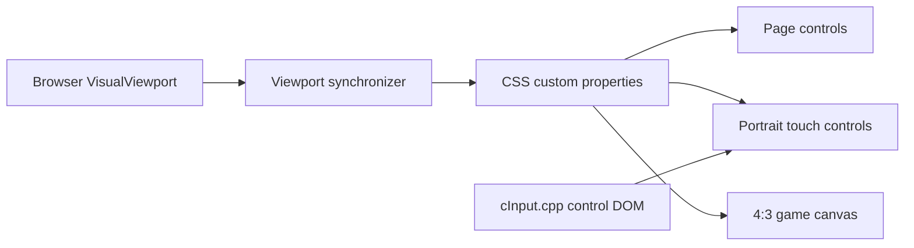
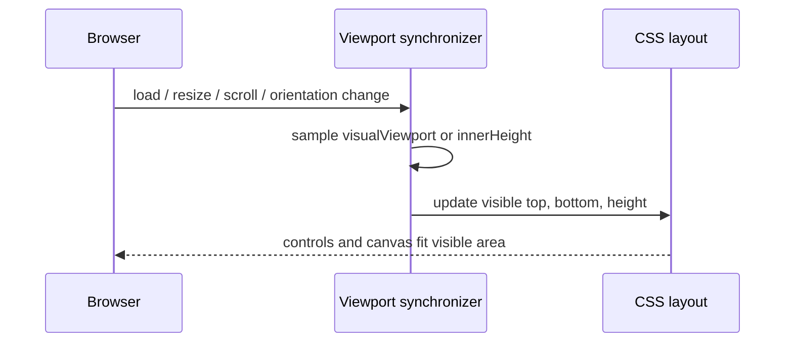
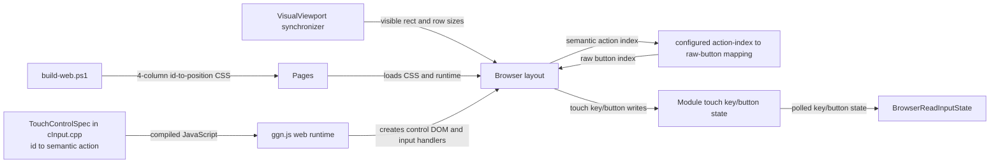
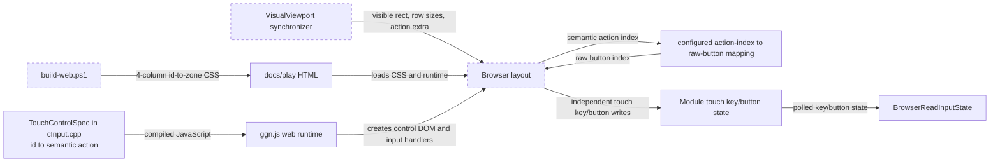
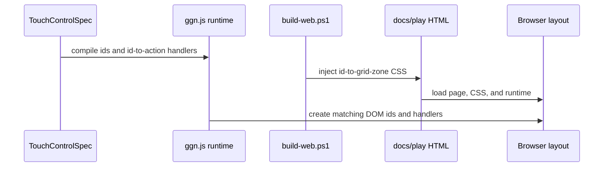
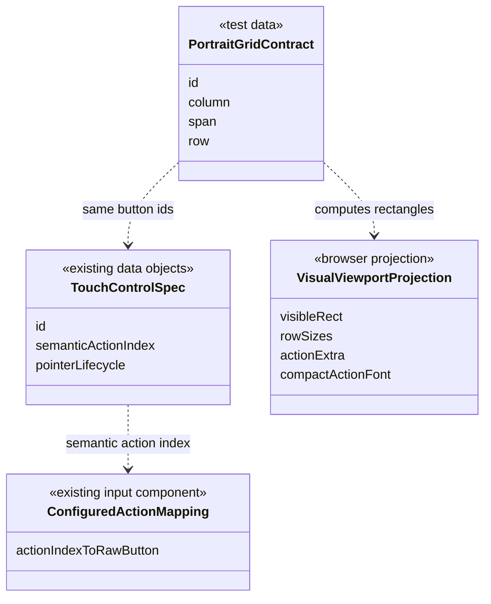

# Portrait visual viewport fit

## Challenge / purpose / success

- Challenge: mobile portrait controls can extend below the actually visible browser area when browser chrome reduces `window.visualViewport` without reducing the CSS layout viewport.
- Purpose: keep every touch control visible and immediately tappable while retaining the enlarged portrait controls whenever space permits.
- Success: all 17 portrait buttons, the 4:3 canvas, and page controls remain inside the actual visible viewport without overlap; landscape, fullscreen, hidden-controls, gamepad/key configuration, and audio lifecycle behavior remain unchanged.

## Authority and invariant

`window.visualViewport` owns the visible top, bottom, and height. A small page synchronizer projects those values to CSS custom properties. When `VisualViewport` is unavailable, `window.innerHeight` is the fallback authority.

Invariant: in portrait mobile mode, the page controls, 4:3 canvas, and touch panel must all remain inside the visible viewport without overlap. The page-control strip is `max(40px, safe-area-top + 36px)` and a compact minimum game region is reserved before touch rows are scaled. Target row heights are preserved while they fit and are reduced only as much as required by the remaining visible height. The supported visual-height floor is 400px including representative 47px top and 34px bottom safe areas; at that boundary every control row remains at least 32px and the 4:3 game remains at least 80px high.



## Runtime sequences



Fallback path: if `window.visualViewport` is missing, the same synchronizer publishes `innerHeight` with zero visual offset. No domain entities or services are introduced; this is browser UI infrastructure only.

## Alternatives

- CSS `svh` only: rejected because it cannot reliably represent `visualViewport.offsetTop` and OEM browser chrome behavior.
- Always reduce the buttons: rejected because it regresses the requested portrait button size.
- Scrollable controls: rejected because controls must stay simultaneously visible and immediately tappable.

## Blast radius and verification

- Generator: `tools/build-web.ps1`
- Generated trial pages: `docs/play/ggn.html`, `docs/play/index.html`
- Contract tests: `tools/test-web-touch-layout.js`
- Regression checks: landscape and hidden-controls layout, fullscreen controller, gamepad/key configuration, and audio lifecycle tests

## Portrait action-side restoration

### Approved decision and requirements

- New authoritative requirement: in portrait, the direction cluster stays on the left and the combat actions (`attack`, `dash`, `smartdash`, and `shot`) stay on the right so two-thumb movement-plus-action input is possible.
- Approval record: after the introduction point and current layout were shown, the user stated that attack controls belong on the right and confirmed, “ここは元に戻すべきです”.
- Preserved requirements: all 17 controls remain inside the visible viewport; 320px and 360px portrait buttons retain the enlarged minimum dimensions; landscape, hidden-controls, fullscreen, key configuration/gamepad mapping, and audio lifecycle behavior do not change.

The portrait panel keeps four equal columns. In gameplay rows, columns 1–3 are the movement zone and column 4 is the combat-action rail. This retains 83px buttons at 360px and 73px at 320px. `smartdash` changes from a two-column positional projection to one column, but remains at or above the established enlarged minimum; this is the necessary spatial trade-off for the user-approved left/right separation. The utility row is not part of the simultaneous-input boundary, so `map` and `menu` retain their established two-column widths. Rows 2–4 use the existing action height for the direction cluster and `attack`/`dash`/`smartdash`; row 5 uses the main height for `turn`/`diag` and `shot`.

At constrained visual heights, let `availableTracks = visibleHeight - pageStrip - minimumCanvas - (4 * 4px row gaps) - 12px canvas gap - max(12px, safeBottom)`. The allocation order is fixed: first reserve the target action extras, scale the base rows against the remainder using the existing 32px floor, then recover the largest equal extra that fits:

```text
targetExtra = 8
baseBudget = max(0, availableTracks - 3 * targetExtra)
(utility, main) = scaleExistingTargetsInto(baseBudget, floor = 32)
actionExtra = clamp((availableTracks - utility - 4 * main) / 3, 0, targetExtra)
```

At the supported 400px boundary with 47px top and 34px bottom safe areas, `availableTracks = 175px`, `baseBudget = 151px`, `utility = main = 32px`, `actionExtra = 5px`, the three action rows are 37px, and the canvas remains 80px. The grid explicitly keeps `column-gap: 4px; row-gap: 4px`. In compact rows, two-line big-button text scales down with the available action-row height (15px floor) so text remains inside the hit target.

| Row | Left movement/utility zone (columns 1–3) | Right action rail (column 4) | Track |
|---|---|---|---|
| 1 | `map` (span 2) | `menu` (columns 3–4, span 2) | utility |
| 2 | `up-left`, `up`, `up-right` | `attack` | main + action extra |
| 3 | `left`, `step`, `right` | `dash` | main + action extra |
| 4 | `down-left`, `down`, `down-right` | `smartdash` | main + action extra |
| 5 | `turn`, `diag`, empty | `shot` | main |

### Alternatives and review correction

- Restore the pre-`e7d3a4b` two-pad dimensions exactly: rejected because it restores the small portrait button widths that prompted the enlargement work.
- Four equal columns with a one-column action rail: selected after review; action-height tracks avoid shortening `attack`/`dash`, while one-column `smartdash` remains above the existing minimum.
- Five equal semantic columns: rejected because a 320px viewport produces sub-63px cells.
- Five asymmetric columns with two narrow action tracks: rejected after review because it adds a fifth selector track and special column gap for only about 3px of action width over the four-column rail.

### Module relationship — current and target

Current:



Target:



### Representative sequences

Build/load selector binding:



Main path — two independent pointers:

```mermaid
sequenceDiagram
    actor Player
    participant Browser as Browser handlers
    participant Mapping as configured action mapping
    participant ModuleState as Module touch state
    participant GameInput as BrowserReadInputState
    Player->>Browser: pointer 1 down on left direction
    Browser->>ModuleState: capture pointer 1; setTouchKey(direction, true)
    Player->>Browser: pointer 2 down on right attack or dash
    Browser->>Mapping: configuredActionButton(semantic action)
    Mapping-->>Browser: raw button index
    Browser->>ModuleState: capture pointer 2; setTouchButton(raw button, true)
    GameInput->>ModuleState: poll in the same frame
    ModuleState-->>GameInput: direction and raw action are both active
    Player->>Browser: pointer 2 up
    Browser->>ModuleState: release action; keep pointer 1 direction active
    Player->>Browser: pointer 1 up
    Browser->>ModuleState: release remaining direction
```

`dash` is covered by the attack flow because both are held actions with identical pointer lifecycle. `smartdash` is not: it toggles on a right-side pointerdown, remains active after pointerup, toggles off on the next pointerdown, and is cleared with all input state by blur/visibility/hidden-controls.

```mermaid
sequenceDiagram
    actor Player
    participant Browser as Browser layout / input handlers
    Player->>Browser: hold a left-side direction
    Player->>Browser: pointerdown on right-side smartdash
    Browser->>Browser: toggle action 7 on
    Player->>Browser: pointerup on smartdash
    Note over Browser: action 7 remains on; direction remains held
    Player->>Browser: second pointerdown on smartdash
    Browser->>Browser: toggle action 7 off
    Player->>Browser: hide controls or page becomes hidden
    Browser->>Browser: blur/visibility clears all input state
```

Visual-viewport edge path:

```mermaid
sequenceDiagram
    actor BrowserHost as Browser / OS chrome
    participant Viewport as VisualViewport synchronizer
    participant Browser as Browser layout
    BrowserHost->>Viewport: resize or visual viewport offset change
    Viewport->>Viewport: preserve row floors; reduce action extra if required
    Viewport->>Browser: publish visible rect, row sizes, action extra
    Browser->>Browser: recompute four columns and five rows
    Note over Browser: all 17 controls remain inside the visible viewport;<br/>right-side action zone remains disjoint from movement
```

Fullscreen is covered by the same viewport-resync sequence. Landscape is N/A to the changed CSS because the selector is portrait-only and the existing landscape geometry suite remains the regression authority. Hidden-controls is N/A to placement because it removes the panel; its existing blur-release executable test remains the input-state authority. Gamepad input is N/A to pointer placement; existing saved-mapping and gamepad executable tests remain authoritative.

### Class/component relationship



No domain data class, service, or entity is introduced. `TouchControlSpec` owns `id → semantic action index`; saved configuration owns `semantic action index → raw pad button`; CSS is only the `id → rectangle` projection. Contract tests bind all 17 unique CSS selectors to one geometry table, bind combat-control ids to their production semantic action indices, and assert zone separation, size, containment, non-overlap, the 400px `32px + 5px` compact-row boundary, and compact action-text fit at 320px, 360px, compact/safe-area, and landscape viewports.

### Blast-radius delta

- Changed: portrait-only CSS positions and action-extra projection in `tools/build-web.ps1`, generated trial HTML, and the portrait selector/geometry model in `tools/test-web-touch-layout.js`.
- Unchanged by design: control DOM/input ownership in `source/gameMainSystem/cInput.cpp`, landscape CSS, fullscreen/hidden-controls behavior, saved key/gamepad configuration, and audio lifecycle.
